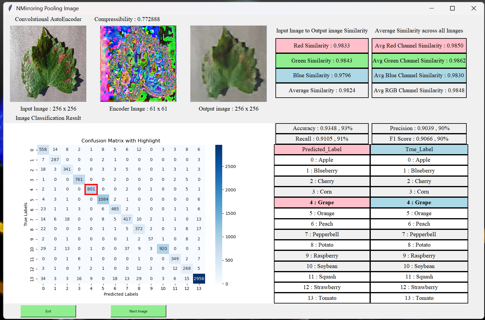

# Leaf_Project
### 日本語版
#### このプロジェクトは病気の葉っぱから画像認識を行うモデルと画像復元するためのモデルを組み合わせた深層学習モデルをGUIを使用して表示するためのプロジェクトです。
完成版の写真はSystemGUI_Picture.pngで掲示しています。また、ライブラリに関しては各自でインポートしてください。

#### データセット
データセットは、[PlantVillage](https://data.mendeley.com/datasets/tywbtsjrjv/1)です。
データセットは葉っぱの分類のデータセットで各病気の種類で分類するタスクです。その分類を植物の分類に変換したデータセットで学習を行っています。
以下はデータセットのクラスです。 
1 Apple, 2 Blueberry, 3 Cherry, 4 Corn, 5 Grape, 6 Orange, 7 Peach, 8 Pepperbell, 9 Potato, 10 Rasberry, 11 Soybean, 12 Squash, 13 Strawberry, 14 Tomato

#### プログラム実行手順
1 Convolutional_AutoEncoder.py 
このコードは畳み込みオートエンコーダーを設計したコードです。畳み込みにはCNNと逆畳み込みを使用しています。 
2 Classification.py 
画像認識モデルを設計したコードです。画像認識モデルの基本はWideResNetを参考にして作成しています。 
3. AutoEncoder_Train.py 
畳み込みオートエンコーダーのパラメータを学習するためのコードです。最適化アルゴリズムをAdamとしています。 
4. Classification_Train.py 
画像認識モデルのパラメータを学習するためのコードです。同様に最適化アルゴリズムをAdamとしています。 
5. System_GUI.py 
畳み込みオートエンコーダーの復元画像過程や画像認識モデルの性能評価を画面に表示するためのGUI作成したコードです。 
完成版の写真を以下に示します。  

#### 最後に
ソースコードにコメントはありません。また、初めてGithubに成果を掲載しています。何かコメントがあればうれしいです。 
もし禁止事項に触れていたらご連絡ください。 

### English version
#### The project is to train a model that combines convolutional autoencoder and image recognition and display the resulting GUI.
It is OK if the GUI display looks like SystemGUI_Picture.png. Please import libraries as needed.  

#### Dataset
Dataset is [PlantVillage](https://data.mendeley.com/datasets/tywbtsjrjv/1).
Disease dataset, but classified by plants only. However, background images are excluded.

#### Program Flow(To be performed in the following sequence)
1. Convolutional_AutoEncoder.py 
   1.1. Code for Convolutional Autoencoder design 
2. Classification.py 
   2.1. Design code for Image Recognition Model 
3. AutoEncoder_Train.py 
   3.1. Code for learning Convolutional Autoencoder 
4. Classification_Train.py 
   4.1. Code for learning Image Recognition Model 
5. System_GUI.py 
   5.1 Display for evaluation of Combined Models 

#### Final
There are no comments in the source code.
Also, for the first time, I'm posting the results on Github. Any comments would be appreciated. Please contact me if I'm mentioning anything prohibited.
